# Winslow — Architectural Overview

## 1. System Overview

Winslow is a project management suite built as a monorepo with two main components: an F# REST API (backend) and a Flutter cross-platform client (frontend). The architecture follows **Domain-Driven Design (DDD)** with **Railway-Oriented Programming** for error handling, **CQRS** for separating reads and writes, and a **plugin-based frontend** for feature isolation.

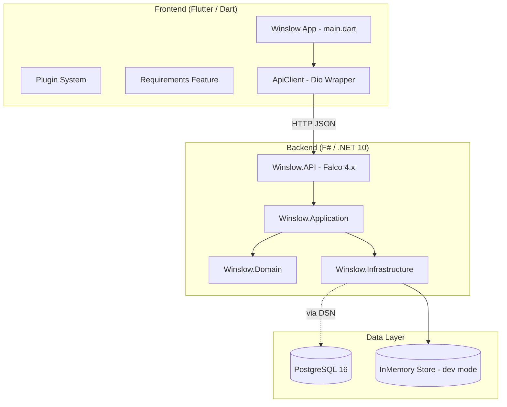

### Layer Dependency Graph (Backend)

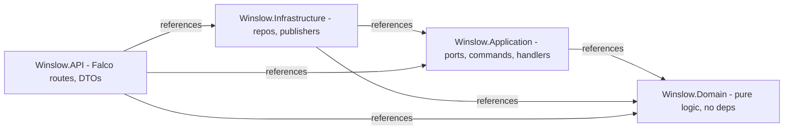

---

## 2. Backend Architecture

### 2.1 Layer Breakdown

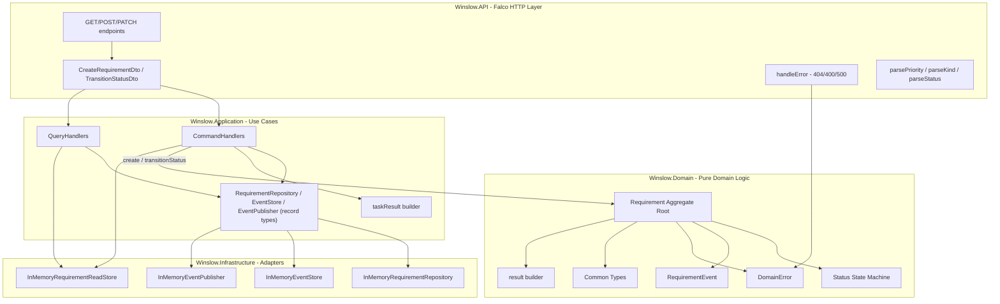

### 2.2 Domain Layer (`Winslow.Domain`)

The innermost layer with **zero dependencies**. It contains:

| Module | Contents |
|--------|----------|
| `Common/Types.fs` | `RequirementId`, `ProjectId`, `UserId`, `Timestamp`, `NonEmptyString`, `ResultBuilder` |
| `Common/Errors.fs` | `DomainError` (5 cases), `AppError` (3 cases) |
| `Requirements/RequirementTypes.fs` | `RequirementStatus`, `RequirementPriority` (MoSCoW), `RequirementKind`, `AcceptanceCriteria` |
| `Requirements/RequirementEvents.fs` | `RequirementEvent` union with 4 event types |
| `Requirements/Requirement.fs` | `Requirement` opaque DU (private constructor), `create`, `update`, `transitionStatus`, field accessor functions, `hydrate` |
| `Projects/ProjectTypes.fs` | `ProjectStatus`, `ProjectMethodology` |
| `Projects/Project.fs` | `Project` record, `create` |

All domain functions are **pure** — they take input, validate, and return `Result<value, DomainError>` with no side effects.

### 2.3 Application Layer (`Winslow.Application`)

Orchestrates use cases via **Command Handlers** and **Query Handlers**. Depends only on the Domain layer.

**Ports** (records of functions):
- `RequirementRepository` — `FindById`, `FindByProject`, `Save`, `Delete`
- `EventPublisher` — `Publish`
- `EventStore` — `Append`, `ReadStream` (append-only event stream)
- `RequirementReadStore` — `GetById`, `GetByProject`, `Upsert`, `Delete`

**Handlers** use the `taskResult { }` computation expression to chain async operations with Railway-Oriented Programming:

```
Command -> Domain function -> repo.Save -> eventStore.Append -> readStore.Upsert -> publisher.Publish -> Result
```

**Read Models** are string-typed DTOs (all DU wrappers unwrapped) for direct JSON serialization.

Bind operators `>>=` are available for both `Result` (domain layer) and `Task<Result<_,_>>` (application layer) for explicit pipe-style chaining.

### 2.4 Infrastructure Layer (`Winslow.Infrastructure`)

Implements the ports:

| Adapter | Implementation | Notes |
|---------|---------------|-------|
| `InMemoryRequirementRepository` | `ConcurrentDictionary<Guid, Requirement>` | Seeds 2 demo requirements, factory function returning `RequirementRepository` record |
| `InMemoryEventStore` | `ConcurrentDictionary<Guid, EventEnvelope list>` | Append-only event stream with versioning |
| `InMemoryRequirementReadStore` | `ConcurrentDictionary<Guid, RequirementReadModel>` | Denormalized read projection, dual-written from command handlers |
| `InMemoryEventPublisher` | `printfn` | Logs event type + description to console |

### 2.5 API Layer (`Winslow.API`)

Single `Program.fs` using **Falco 4.x** with:

- `System.Text.Json` (camelCase, case-insensitive)
- Manual string-to-DU parsing via helper functions
- Centralized `handleError` mapping `AppError` -> HTTP status codes

| Endpoint | Handler | Returns |
|----------|---------|---------|
| `GET /projects/{projectId}/requirements` | `apiGetProjectRequirements` | `RequirementListItem[]` |
| `GET /requirements/{id}` | `apiGetRequirementById` | `RequirementReadModel` |
| `POST /requirements` | `apiCreateRequirement` | `201 { id: "guid" }` |
| `PATCH /requirements/{id}/status` | `apiTransitionStatus` | `200 { status: "ok" }` |

### 2.6 Data Flow Example — Create Requirement

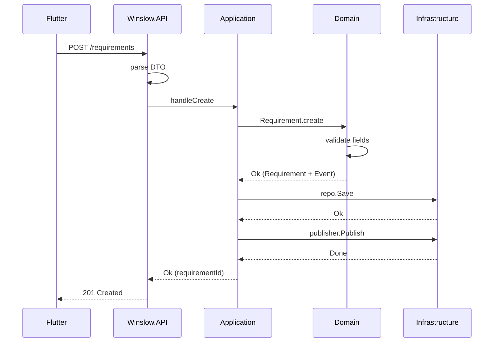

---

## 3. Frontend Architecture

### 3.1 Plugin System

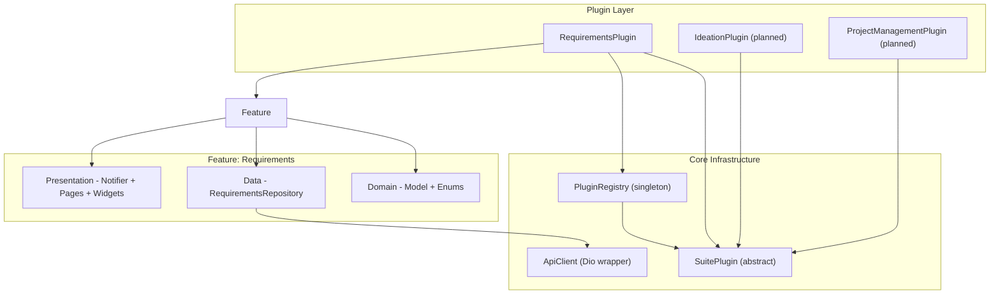

### 3.2 State Management (Riverpod)

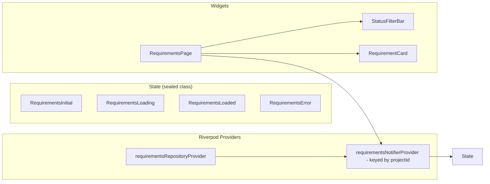

### 3.3 Navigation (go_router)

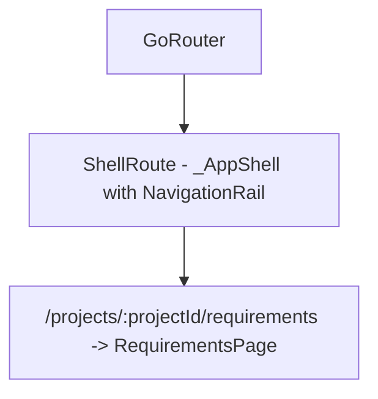

### 3.4 Frontend Layered Architecture

```
lib/
+-- core/
|   +-- api/api_client.dart               Dio wrapper, interceptors
|   +-- plugin_system/plugin.dart          SuitePlugin abstract class
|   +-- plugin_system/plugin_registry.dart singleton registry
+-- features/requirements/
|   +-- domain/requirement.dart            Model, enums, fromJson
|   +-- data/requirements_repository.dart  HTTP calls via Dio
|   +-- presentation/
|       +-- bloc/requirements_notifier.dart Riverpod StateNotifier
|       +-- pages/requirements_page.dart   Main screen
|       +-- widgets/
|           +-- requirement_card.dart      Card with status popup
|           +-- status_filter_bar.dart     Filter chips
+-- plugins/
|   +-- requirements_plugin.dart          Glue: plugin to feature
+-- main.dart                             Entry, Providers, Router, Shell
```

---

## 4. The Requirements Lifecycle Process

The core business process in Winslow is the lifecycle of a requirement — from initial capture through review, approval, and implementation.

### 4.1 High-Level Overview

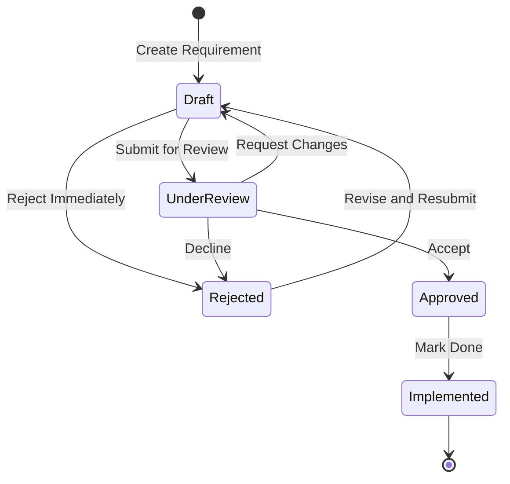

The state machine is defined in `Winslow.Domain.Requirements.RequirementTypes` and enforced at the domain level:

| From | Allowed Transitions | Guard |
|------|--------------------|-------|
| Draft | UnderReview, Rejected | - |
| UnderReview | Approved, Rejected, Draft | - |
| Approved | Implemented, UnderReview | - |
| Rejected | Draft | - |
| Implemented | - | Terminal state |

Invalid transitions produce `DomainError.InvalidTransition("Draft", "Approved")`.

### 4.2 Detailed Walkthrough

#### 4.2.1 Creation

1. **User** fills a form on the frontend with title, description, MoSCoW priority, kind, and acceptance criteria.
2. **Frontend** calls `POST /requirements` via `RequirementsRepository.create()` using the Dio HTTP client.
3. **API** receives `CreateRequirementDto`, parses string fields into domain types (`parsePriority`, `parseKind`), hardcodes the demo author ID, and dispatches `handleCreate`.
4. **Application** maps the command to `CreateRequirementInput` and calls domain `Requirement.create()`.
5. **Domain** validates:
   - Title is non-empty (wrapped in `NonEmptyString`)
   - Acceptance criteria list is not empty
   - All enum values are valid
6. On success, a `Requirement` aggregate is created in `Draft` status and a `RequirementCreated` event is emitted.
7. The requirement is persisted (in-memory or PostgreSQL) and the event is published (console-logged or queued).

#### 4.2.2 Status Transitions

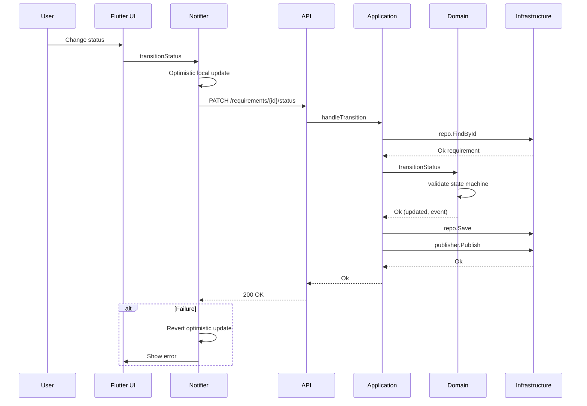

Key design decisions in this flow:

- **Optimistic UI**: The frontend updates local state immediately, then reconciles on API response.
- **Domain enforcement**: The state machine guard is implemented in pure F# in the Domain layer. Even if the frontend allows an invalid transition, the backend rejects it with 400.
- **Event sourcing readiness**: Every state transition emits a `RequirementStatusChanged` event, enabling audit trails and event-driven integrations.

#### 4.2.3 Status Display Rules

| Status | UI Color | Description |
|--------|----------|-------------|
| Draft | Grey | Initial state, editable |
| UnderReview | Orange | Awaiting approval |
| Approved | Green | Ready for implementation |
| Rejected | Red | Declined, can be revised |
| Implemented | Blue | Done, terminal |

---

## 5. Data Storage & Deployment

### 5.1 Storage Strategy

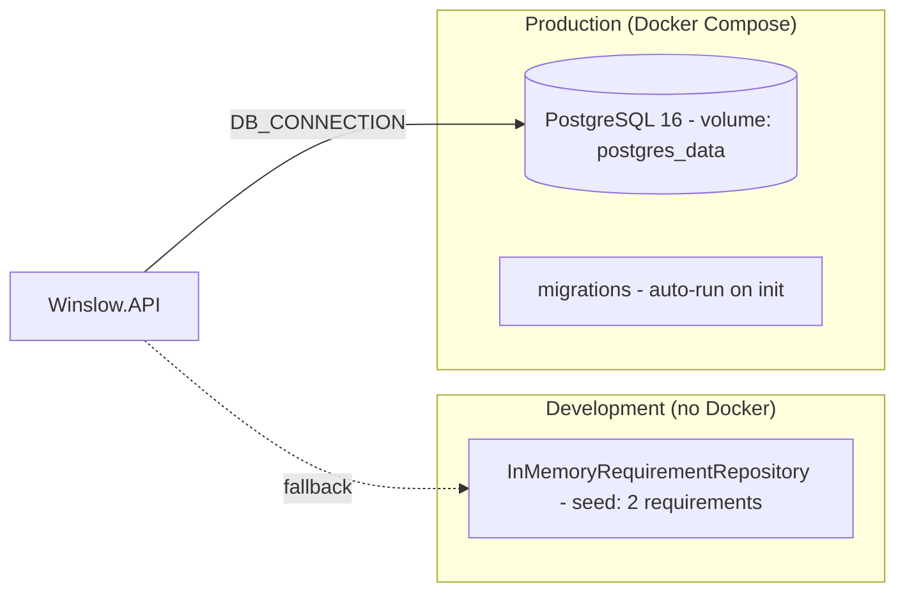

Currently, the in-memory repository is always used — the PostgreSQL adapter is not yet implemented despite the Docker Compose and migration files being ready.

### 5.2 Docker Deployment

```
docker-compose.yml
+-- service: postgres
|   +-- image: postgres:16-alpine
|   +-- port: 5432
|   +-- volume: postgres_data (persistent)
|   +-- volume: ./backend/migrations -> /docker-entrypoint-initdb.d/
|
+-- service: api
    +-- build: ./backend/Dockerfile (multi-stage .NET 10)
    +-- port: 5000
    +-- env: DB_CONNECTION, ASPNETCORE_ENVIRONMENT, ASPNETCORE_URLS
    +-- depends_on: postgres
```

### 5.3 Database Schema

Three tables defined in `001_initial_schema.sql`:

- **`projects`** — UUID PK, name, description, status, methodology, owner, timestamps
- **`requirements`** — UUID PK, FK to projects, title, description, status, priority, kind, acceptance_criteria (JSONB), author, timestamps. Indexed on project_id, status, priority.
- **`domain_events`** — UUID PK, aggregate_id, event_type, payload (JSONB), occurred_at. Indexed on aggregate_id, event_type.

All UUIDs are generated via PostgreSQL's `pgcrypto` extension (`gen_random_uuid()`).

---

## 6. Railway-Oriented Programming Pattern

The entire backend uses a functional error-handling approach:

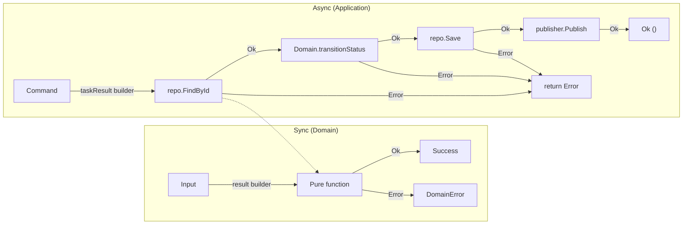

**Custom builders** (since F# 10 removed built-in `result { }`):

```fsharp
// Domain - sync
type ResultBuilder() =
    member _.Bind(m, f) = Result.bind f m
    member _.Return(x)  = Ok x
let result = ResultBuilder()

// Application - async + Result combined
type TaskResultBuilder() =
    member _.Bind(m, f) = task {
        let! r = m
        match r with
        | Ok v    -> return! f v
        | Error e -> return Error e
    }
let taskResult = TaskResultBuilder()
```

This allows mixing `Result`-returning domain functions and `Task<Result>`-returning repository calls in a single `taskResult { }` expression without manual nesting.

---

## 7. Error Handling & Status Code Mapping

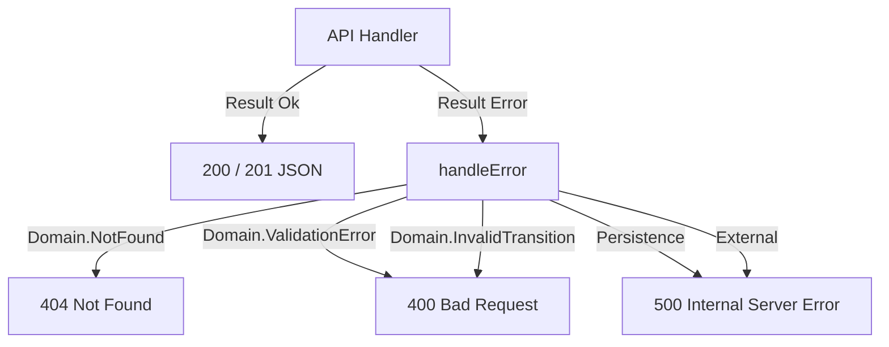

---

## 8. Project Structure Summary

```
Winslow/
+-- backend/
|   +-- Winslow.sln
|   +-- docker-compose.yml
|   +-- Dockerfile
|   +-- migrations/001_initial_schema.sql
|   +-- src/
|   |   +-- Winslow.Domain/              Pure domain logic
|   |   +-- Winslow.Application/         Use cases
|   |   +-- Winslow.Infrastructure/      Adapters
|   |   +-- Winslow.API/                Falco HTTP
|   +-- tests/                           Empty placeholder
|
+-- frontend/
    +-- pubspec.yaml
    +-- lib/
    |   +-- main.dart                    Entry point
    |   +-- core/
    |   |   +-- api/api_client.dart      Dio wrapper
    |   |   +-- plugin_system/           Plugin system
    |   +-- features/requirements/       Feature module
    |   +-- plugins/                     Plugin registration
    +-- test/
```

---

## 9. Key Architectural Decisions

| Decision | Rationale |
|----------|-----------|
| 4-layer DDD backend | Separation of concerns; Domain has zero deps, Application orchestrates, Infrastructure adapts, API serves |
| Railway-Oriented Programming | No exceptions for control flow; explicit `Result<Ok, Error>` forces handling at every level |
| Custom CE builders | F# 10 removed built-in `result { }`; custom builders provide same ergonomics |
| In-memory repository default | Zero-setup development; PostgreSQL adapter ready for production swap |
| Plugin-based frontend | Feature isolation - each domain is a self-contained plugin |
| Riverpod with override pattern | Clean dependency injection - repository provider throws by default, overridden in `main.dart` |
| Optimistic UI updates | Instant feedback for status transitions; reconciled on API response |
| Manual serialization (no freezed) | Simplicity for current scale; toolchain is ready for future code-gen adoption |

---

## 10. Resolved Issues

Issues from the original MVP audit that have been addressed.

| # | Issue | Resolution |
|---|-------|------------|
| O-1 | **Anemic aggregate** — `Requirement` was a public record; any layer could bypass domain functions and modify fields via `{ req with Status = Approved }`. | Changed to single-case DU with `private` constructor; all access through module functions (`create`, `transitionStatus`, `update`, `hydrate`) |
| O-2 | **No event sourcing** — Events were printed to console and discarded. | `EventStore` port + `InMemoryEventStore` implementation appends events with versioning; `EventEnvelope` wraps events with metadata |
| O-3 | **CQRS-lite** — Read models mapped from the same aggregate repository. | `RequirementReadStore` port + `InMemoryRequirementReadStore`; query handlers read from read store, command handlers dual-write to both stores |
| O-4 | **OO interfaces vs F# idioms** — `IRequirementRepository` and `IEventPublisher` were .NET interfaces. | Replaced with records of functions (`RequirementRepository`, `EventPublisher`, `EventStore`) |
| O-6 | **Duplicate read models** — `RequirementReadModel` and `RequirementListItem` were identical. | Unified into single `RequirementReadModel` type |
| O-7 | **Missing aggregate boundary** — Repository returned full aggregate to any caller. | Aggregate is now opaque (private DU constructor); repository can store/load but callers must use accessor functions |

## 11. Remaining Open Issues

| # | Issue | Impact | Files | Intended Fix |
|---|-------|--------|-------|--------------|
| O-5 | **No domain services or specifications** — Cross-aggregate logic and query filtering are inlined in handlers rather than expressed as domain concepts. | Domain logic leaks into Application layer | `Application/Requirements/QueryHandlers.fs`, `Domain/` | Introduce domain services for multi-aggregate workflows; specification types for queries |
