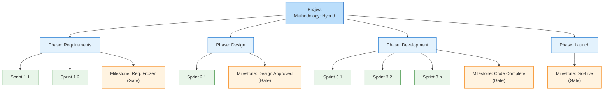
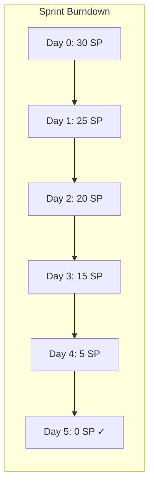
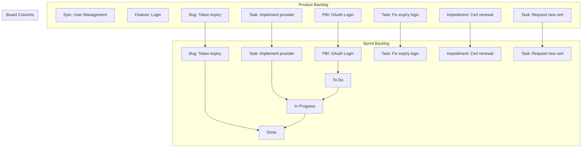

# Winslow — Features and Ideas

## Planned Features

### P-1: Ideation Plugin

A plugin for brainstorming, collecting, and voting on feature ideas before
they become formal requirements.

- Registered in `frontend/lib/main.dart:19` (currently commented out)
- Referenced in `docs/architecture.md:197` as `IdeationPlugin (planned)`

### P-2: Project Management Plugin

A single plugin that supports Waterfall, Agile (Scrum/Kanban), and Hybrid
project methodologies. The plugin adapts its views based on the project's
`ProjectMethodology` field rather than splitting into separate plugins.

**Decision**: Single plugin — shared concepts (milestones, timeline, backlog)
belong together. Hybrid projects need both paradigms in one place.

#### Waterfall Concepts

- **Phases** — sequential stages (user-defined name, start/end date, status)
  - Optional standard presets (e.g. Requirements → Design → Implementation →
    Verification → Maintenance)
- **Milestones (gated)** — key events marking phase completion; advancing to
  the next phase requires explicit approval
- **Gantt view** — timeline visualization of phases and milestones
- **Phase-gate workflow** — each phase can be locked/unlocked, gate approval
  tracked as an event

#### Agile Concepts

- **Sprints** — timeboxed iterations (goal, start/end date, retrospective notes)
- **Backlog** — prioritized items with story points, status, and sprint assignment
- **Board** — configurable columns per sprint or project-wide (Kanban style)
  - Scrum mode: Todo / In Progress / Done
  - Kanban mode: custom columns with WIP limits
- **Velocity tracking** — story points completed per sprint (chart)

#### BacklogItem Hierarchy

```
Epic (root level, no parent)
  └── Feature (parent = Epic)
        ├── PBI (parent = Feature) ─── pulled into Sprint Backlog
        │     └── Task (parent = PBI)
        ├── Bug (parent = Feature)
        │     └── Task (parent = Bug)
        └── Impediment (parent = Feature)
              └── Task (parent = Impediment)
```

| Type | Parent | In Sprint Backlog? | StoryPoints? | Effort? |
|------|--------|-------------------|--------------|---------|
| Epic | `None` | No | No | No |
| Feature | `Epic` | No | No | No |
| PBI | `Feature` | Yes (primary item) | Yes | No |
| Task | `PBI \| Bug \| Impediment` | Yes (child) | No | Yes (hours) |
| Bug | `Feature` | Yes (like PBI) | Yes | No |
| Impediment | `Feature` | Yes (like PBI) | No | No |

#### Boards

| | Product Backlog | Sprint Backlog |
|---|---|---|
| Shows | `Epic → Feature → PBI/Task/Bug/Imped` | `PBI → Task` (no Epics/Features) |
| Where | `SprintId = None` | `SprintId = currentSprint` |
| Action | Prioritise, refine, break down | Execute, update status, burn down |

#### Proposed Domain Types

```fsharp
type ProjectMethodology = Scrum | Kanban | Waterfall | Hybrid

type Phase = {
    Id         : PhaseId
    ProjectId  : ProjectId
    Name       : NonEmptyString
    Sequence   : int
    StartDate  : DateTime
    EndDate    : DateTime
    Status     : PhaseStatus  // Planned | Active | Completed | Cancelled
}

type Milestone = {
    Id           : MilestoneId
    PhaseId      : PhaseId option
    Name         : NonEmptyString
    Date         : DateTime
    IsGate       : bool
    ApprovedAt   : Timestamp option
}

type Sprint = {
    Id            : SprintId
    PhaseId       : PhaseId option  // None = standalone agile project
    Name          : NonEmptyString
    Goal          : string
    StartDate     : DateTime
    EndDate       : DateTime
    Status        : SprintStatus  // Planned | Active | Completed
}

type BacklogItemType =
    | Epic
    | Feature
    | PBI
    | Task
    | Bug
    | Impediment

type BacklogItem = {
    Id           : BacklogItemId
    ParentId     : BacklogItemId option  // None only for Epic
    ItemType     : BacklogItemType
    Title        : NonEmptyString
    Description  : string
    Priority     : int
    StoryPoints  : int option            // PBIs, Bugs
    Effort       : float option          // Tasks (estimated hours)
    Status       : BacklogItemStatus     // Open | InProgress | Done | Cancelled
    PhaseId      : PhaseId option        // links to waterfall phase (hybrid)
    SprintId     : SprintId option       // None = product backlog
}

type BoardColumn = {
    Id         : BoardColumnId
    Name       : string
    WipLimit   : int option
    Order      : int
}
```

- Registered in `frontend/lib/main.dart:20` (currently commented out)
- Referenced in `docs/architecture.md:198` as `ProjectManagementPlugin (planned)`

### P-3: PostgreSQL Repository Adapter

Replace the in-memory repository with a real PostgreSQL implementation.

- Docker Compose (`docker-compose.yml`) and migrations (`backend/migrations/001_initial_schema.sql`)
  are ready and tested
- Database schema includes tables for `projects`, `requirements`, and `domain_events`
- Requires implementing `IRequirementRepository` against Npgsql
- Referenced in `docs/architecture.md:406`

### P-4: JWT Authentication

Add user authentication with JWT tokens.

- TODO at `frontend/lib/core/api/api_client.dart:25`:
  `// TODO: JWT-Token aus SecureStorage lesen`
- TODO at `frontend/lib/core/api/api_client.dart:34`:
  `// TODO: Token-Refresh-Flow`
- Currently no auth middleware on the API side

---

## Improvements & Technical Debt

### I-1: Backend Test Suite

Set up test projects and write tests.

- `backend/tests/Winslow.Application.Tests/` — empty directory
- `backend/tests/Winslow.Domain.Tests/` — empty directory
- No test runner or CI pipeline configured

### I-2: Frontend Feature Tests

Expand beyond the single smoke test.

- `frontend/test/widget_test.dart` — only checks that the app renders
- No unit tests for notifiers, repositories, or domain models

### I-3: Freezed / Code Generation

Adopt code generation for models and JSON serialization.

- Referenced in `docs/architecture.md:543`:
  "toolchain is ready for future code-gen adoption"
- Dependencies `freezed`, `freezed_annotation`, `json_serializable`,
  `json_annotation` are already in `pubspec.yaml:29,38-40`

### I-4: Create Requirement UI

Implement the actual form/modal for creating requirements.

- TODO at `frontend/lib/features/requirements/presentation/pages/requirements_page.dart:81`:
  `// TODO: CreateRequirementSheet`
- Currently shows a "coming soon" snackbar

### I-5: Frontend Tests

Add unit and widget tests for the requirements feature.
Referenced in `AGENTS.md:23`: "No test command"

### I-6: Backend Tests

Add unit tests for domain logic and application handlers.
Referenced in `AGENTS.md:16`: "Test project directories are empty placeholders"

### I-7: CI Pipeline

Set up continuous integration.

- Referenced in `AGENTS.md:52`: "No CI, no pre-commit hooks, no task runner config files"

### I-8: Android Release Configuration

Configure production signing for Android builds.

- TODO at `frontend/android/app/build.gradle.kts:23`: unique Application ID
- TODO at `frontend/android/app/build.gradle.kts:35`: release signing config

---

## Open Questions

- Should the API support batch status transitions?
- Should requirements support file attachments?
- Should there be a notification system for status changes?
- Should the frontend support offline mode with local caching?

---

## Appendix A: Hybrid Planning — Project Breakdown

The following diagram illustrates how Waterfall phases and Agile sprints
compose into a Hybrid project structure:



**Legend:**
| Shape | Colour | Meaning |
|-------|--------|---------|
| Rounded rect | Blue | Project / Phase (waterfall) |
| Rounded rect | Green | Sprint (agile execution) |
| Diamond rect | Orange | Milestone / Gate (waterfall) |

---

## Appendix B: Agile Planning Model

### B.1 Overview

Agile planning in Winslow uses a two-board model:

| Board | Scope | Contents |
|-------|-------|----------|
| **Product Backlog** | Entire project | All unassigned items, full hierarchy |
| **Sprint Backlog** | Current sprint | PBIs/Bugs/Impediments + their Tasks |

---

### B.2 Product Backlog

The single source of truth for all planned work. Items live here until they are
pulled into a sprint. The full hierarchy is visible:

```
Epic: "User Management"  (Priority: 1)
  └── Feature: "Login"   (Priority: 1)
        ├── PBI: "OAuth Login"         StoryPoints: 8   (Priority: 1)
        │     └── Task: "Implement provider"             Effort: 4h
        ├── PBI: "Password Reset"      StoryPoints: 5   (Priority: 2)
        │     └── Task: "Build reset form"               Effort: 3h
        ├── Bug: "Token expiry"        StoryPoints: 3   (Priority: 1)
        │     └── Task: "Fix expiry logic"               Effort: 2h
        └── Impediment: "Cert renewal"                   (Priority: 3)
              └── Task: "Request new cert"               Effort: 1h
  └── Feature: "Registration" (Priority: 2)
        └── PBI: "Registration form"   StoryPoints: 5   (Priority: 1)
```

- Items are ordered by `Priority` (lower = higher)
- Refinement: Features are broken into PBIs, PBIs are estimated with StoryPoints
- Tasks are typically created during Sprint Planning, not in the backlog

---

### B.3 Sprint Backlog

When a sprint starts, PBIs, Bugs, and Impediments are pulled from the Product
Backlog into the Sprint Backlog. The hierarchy flattens:

```
Sprint Backlog — Sprint 2.1
┌────────────────────┬────────────────────┬────────────────────┐
│ To Do              │ In Progress        │ Done               │
├────────────────────┼────────────────────┼────────────────────┤
│ PBI: Password Reset│ PBI: OAuth Login   │ Bug: Token expiry  │
│  └ Task: Build form│  └ Task: Implement │  └ Task: Fix logic │
│                    │   provider         │                    │
│ Impediment:        │                    │                    │
│  Cert renewal      │                    │                    │
│  └ Task: New cert  │                    │                    │
└────────────────────┴────────────────────┴────────────────────┘
```

- Epics and Features are **not visible** in the Sprint Backlog
- Tasks appear indented under their parent PBI/Bug/Impediment
- Moving a PBI to "Done" also completes all its Tasks

---

### B.4 Scrum Mode

**Sprint lifecycle:**

```
Planning ──> Execution ──> Review ──> Retrospective
   │             │            │             │
   │ Pull PBIs   │ Update     │ Demo        │ Inspect &
   │ from        │ board      │ completed   │ adapt
   │ Product     │ daily      │ work        │ process
   │ Backlog     │            │             │
```

- **Sprint Planning**: Team pulls PBIs from Product Backlog, breaks them into
  Tasks, estimates effort, commits to scope.
- **Daily**: Team updates board, identifies blockers.
- **Sprint Review**: Demo completed PBIs to stakeholders.
- **Sprint Retrospective**: Team reflects on process improvements.

**Board columns (fixed):** To Do → In Progress → Done
- No WIP limits (team manages flow through daily sync)
- Burndown chart tracks remaining StoryPoints vs time



---

### B.5 Kanban Mode

Continuous flow — no sprints, no timeboxes. Work is pulled continuously.

**Board columns (custom):**

```
┌──────────┬──────────────┬──────────────┬──────────┬──────────┐
│ Backlog  │ Analysis     │ Development  │ Review   │ Done     │
│ WIP: ∞   │ WIP: 3       │ WIP: 5       │ WIP: 2   │ WIP: ∞   │
├──────────┼──────────────┼──────────────┼──────────┼──────────┤
│ PBI: ... │ PBI: ...     │ PBI: ...     │ PBI: ... │ PBI: ... │
│ Bug: ... │              │              │          │          │
└──────────┴──────────────┴──────────────┴──────────┴──────────┘
```

- WIP limits prevent bottlenecks
- Focus metrics: cycle time, lead time, throughput
- No burndown; instead a Cumulative Flow Diagram (CFD)

---

### B.6 Item Lifecycle by Type

| Type | Enters Product Backlog | Pulled into Sprint | Done condition |
|------|----------------------|--------------------|----------------|
| Epic | Created by PO | Never (stays in Product Backlog) | All child Features complete |
| Feature | Refined from Epic | Never (stays in Product Backlog) | All child PBIs complete |
| PBI | Refined from Feature | Sprint Planning | Moved to Done column |
| Task | Sprint Planning breakdown | Same sprint as parent PBI | Moved to Done column |
| Bug | Found and logged | Sprint Planning (or expedite) | Moved to Done column |
| Impediment | Identified by team | Sprint Planning | Resolved |

### B.7 Hierarchy-to-Board Mapping



**Key rule:** Only PBIs, Bugs, Impediments, and Tasks enter the Sprint Backlog.
Epics and Features remain in the Product Backlog as organisational containers.

---

### B.8 Velocity Tracking

Velocity is measured in **StoryPoints per sprint** (Scrum only):

| Sprint | Committed | Completed | Velocity |
|--------|-----------|-----------|----------|
| 1.1 | 30 SP | 25 SP | 25 SP |
| 1.2 | 25 SP | 30 SP | 30 SP |
| 1.3 | 28 SP | 28 SP | 28 SP |
| **Average** | | | **27.7 SP** |

Used during Sprint Planning to forecast how many PBIs the team can commit to.
Kanban projects use **cycle time** and **throughput** instead of velocity.
