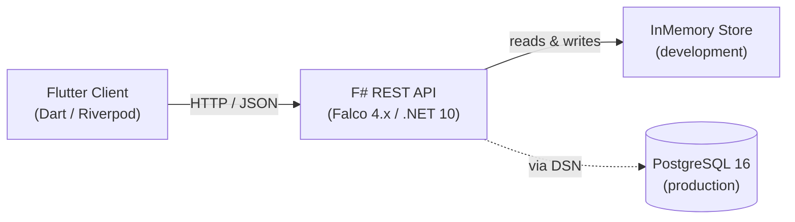

# Winslow — Requirements Document

> Structured following the arc42 template. All requirements written in IREB style (atomic, unambiguous, testable).

## 1. Introduction and Goals

### 1.1 Overview

Winslow is a project management suite for capturing, reviewing, approving, and tracking requirements. It consists of an F# REST API (backend) and a Flutter cross-platform client (frontend).

### 1.2 Goals

| Goal | Priority | Description |
|------|----------|-------------|
| G-1 | High | Provide a requirements lifecycle from draft to implementation |
| G-2 | High | Enforce a state machine with valid transitions only |
| G-3 | Medium | Support MoSCoW prioritisation and requirement typing (functional/non-functional) |
| G-4 | Medium | Enable plugin-based feature isolation on the frontend |
| G-5 | Low | Be ready for PostgreSQL persistence and event-driven integrations |

### 1.3 Stakeholders

| Role | Interest |
|------|----------|
| Product Owner | Define and prioritise requirements |
| Developer | Implement and track requirement status |
| Reviewer | Approve or reject submitted requirements |

---

## 2. Constraints

| ID | Constraint | Rationale |
|----|------------|-----------|
| CON-1 | The backend shall use F# with .NET 10. | Technology stack decision |
| CON-2 | The frontend shall use Flutter with Riverpod state management. | Technology stack decision |
| CON-3 | All domain logic shall be pure with zero dependencies. | DDD principle |
| CON-4 | Error handling shall use Railway-Oriented Programming (no exceptions for control flow). | Architectural decision |
| CON-5 | Backend shall run with an in-memory repository by default; no external database required for development. | Zero-setup local development |
| CON-6 | The API shall expose JSON with camelCase naming convention. | Frontend interop requirement |

---

## 3. Context and Scope

### 3.1 System Context



### 3.2 Scope

**In scope:**
- Requirements CRUD (create, read, update)
- Status transitions with state machine enforcement
- Listing requirements with filter by status and priority
- MoSCoW prioritisation
- Functional / non-functional requirement classification
- Plugin-based frontend architecture

**Out of scope (future):**
- User authentication and authorisation (JWT)
- Project management (epics, sprints)
- Ideation and voting
- Real-time collaboration

---

## 4. Solution Strategy

- **Domain-Driven Design** with 4 layers: Domain, Application, Infrastructure, API
- **CQRS** — separate read models (query handlers) and write models (command handlers)
- **Railway-Oriented Programming** via custom `result { }` and `taskResult { }` computation expressions
- **Plugin system** on frontend via abstract `SuitePlugin` class and singleton `PluginRegistry`
- **Optimistic UI updates** for status transitions, reconciled on API response

---

## 5. Requirements View

### 5.1 Functional Requirements

#### 5.1.1 Requirement Management

| ID | Title | Description | Priority |
|----|-------|-------------|----------|
| REQ-FUNC-001 | Create Requirement | The system shall allow a user to create a requirement with title, description, MoSCoW priority, kind (functional/non-functional), and acceptance criteria. | Must |
| REQ-FUNC-002 | List Requirements | The system shall return all requirements for a given project, filterable by status and priority. | Must |
| REQ-FUNC-003 | Get Requirement by ID | The system shall return a single requirement by its unique identifier. | Must |
| REQ-FUNC-004 | Update Requirement | The system shall allow updating a requirement's title, description, priority, kind, and acceptance criteria when the requirement is in Draft status. | Should |
| REQ-FUNC-005 | Delete Requirement | The system shall allow deleting a requirement when it is in Draft or Rejected status. | Could |

#### 5.1.2 Status Transitions

| ID | Title | Description | Priority |
|----|-------|-------------|----------|
| REQ-FUNC-010 | Submit for Review | The system shall transition a requirement from Draft to UnderReview. | Must |
| REQ-FUNC-011 | Approve Requirement | The system shall transition a requirement from UnderReview to Approved. | Must |
| REQ-FUNC-012 | Reject Requirement | The system shall transition a requirement from UnderReview or Draft to Rejected. | Must |
| REQ-FUNC-013 | Mark Implemented | The system shall transition a requirement from Approved to Implemented. | Must |
| REQ-FUNC-014 | Request Changes | The system shall transition a requirement from UnderReview back to Draft. | Should |
| REQ-FUNC-015 | Revise and Resubmit | The system shall transition a requirement from Rejected to Draft. | Should |
| REQ-FUNC-016 | Invalid Transition Rejection | The system shall reject any status transition that is not allowed by the state machine with a 400 Bad Request. | Must |

#### 5.1.3 State Machine

```
Draft --> UnderReview --> Approved --> Implemented
  |         |    |
  v         v    v
Rejected <--+----+
  |
  v
Draft
```

#### 5.1.4 Event Publishing

| ID | Title | Description | Priority |
|----|-------|-------------|----------|
| REQ-FUNC-020 | Publish RequirementCreated | The system shall publish a RequirementCreated event after a requirement is successfully created. | Should |
| REQ-FUNC-021 | Publish RequirementStatusChanged | The system shall publish a RequirementStatusChanged event after a successful status transition. | Should |

### 5.2 Quality Requirements

| ID | Title | Description | Priority |
|----|-------|-------------|----------|
| REQ-QUAL-001 | Input Validation | The system shall reject requests with empty title or no acceptance criteria with 400 Bad Request. | Must |
| REQ-QUAL-002 | Not Found Handling | The system shall return 404 when a requirement with the given ID does not exist. | Must |
| REQ-QUAL-003 | Enum Validation | The system shall reject requests with invalid priority, kind, or status values with 400 Bad Request. | Must |
| REQ-QUAL-004 | JSON Format | All API responses shall use camelCase JSON naming. | Must |
| REQ-QUAL-005 | Error Response Format | All error responses shall include a human-readable error message in the response body. | Should |

### 5.3 Constraints

| ID | Title | Description | Priority |
|----|-------|-------------|----------|
| REQ-CON-001 | Project Context | All requirements shall belong to a project identified by a UUID. | Must |
| REQ-CON-002 | Author Tracking | Every requirement shall record its author (user ID). | Must |
| REQ-CON-003 | Timestamps | Every requirement shall record creation and last-updated timestamps. | Must |

---

## 6. Runtime View

### 6.1 Create Requirement

```
Client -> API: POST /requirements { title, description, priority, kind, acceptanceCriteria }
API -> Application: handleCreate
Application -> Domain: Requirement.create
Domain --> Application: Ok (Requirement + RequirementCreated event)
Application -> Infrastructure: repo.Save
Application -> Infrastructure: publisher.Publish
Application --> API: Ok requirementId
API --> Client: 201 Created
```

### 6.2 Transition Status

```
Client -> API: PATCH /requirements/{id}/status { newStatus }
API -> Application: handleTransition
Application -> Infrastructure: repo.FindById
Application -> Domain: transitionStatus
Domain --> Application: Ok (updated Requirement + event)
Application -> Infrastructure: repo.Save
Application -> Infrastructure: publisher.Publish
Application --> API: Ok
API --> Client: 200 OK
```

---

## 7. Deployment View

### 7.1 Development

```
[Flutter Dev Server] ---HTTP---> [dotnet run (F# API)] ---> [InMemory Repository]
```

### 7.2 Production (Docker Compose)

```
[Flutter App] ---HTTPS---> [API Container (aspnet:10.0)] ---> [PostgreSQL 16 Container]
                                  |
                          [Migrations: 001_initial_schema.sql]
```

---

## 8. Cross-cutting Concepts

### 8.1 Error Handling

All errors follow the Railway-Oriented Programming pattern:

```
DomainError:
  - NotFound
  - ValidationError (field, message)
  - InvalidTransition (from, to)
  - Conflict (message)
  - Unauthorized (message)

AppError wraps DomainError + adds:
  - PersistenceError (message)
  - ExternalError (message)
```

HTTP status code mapping:
| Error | Status |
|-------|--------|
| NotFound | 404 |
| ValidationError | 400 |
| InvalidTransition | 400 |
| Conflict | 409 |
| PersistenceError | 500 |
| ExternalError | 502 |

### 8.2 Serialization

- `System.Text.Json` with `JsonNamingPolicy.CamelCase`
- All discriminated unions unwrapped to their base types (Guid, string) in read models

---

## 9. Architecture Decisions

| ID | Decision | Rationale |
|----|----------|-----------|
| AD-1 | DDD with 4 layers | Clean separation; Domain has zero dependencies |
| AD-2 | Railway-Oriented Programming | Explicit error handling; no exceptions for control flow |
| AD-3 | Custom result/taskResult builders | F# 10 removed built-in `result { }` |
| AD-4 | In-memory repository default | Zero-setup local development |
| AD-5 | Plugin-based frontend | Feature isolation per domain |
| AD-6 | Optimistic UI updates | Instant user feedback for transitions |
| AD-7 | Manual serialization (no freezed) | Simplicity at current scale |

---

## 10. Quality Scenarios

### 10.1 Validation Scenario

**Stimulus:** User sends POST /requirements with empty title
**Response:** HTTP 400 with `{ "error": "title must not be empty" }`
**Measured:** Response time < 100ms

### 10.2 Invalid Transition Scenario

**Stimulus:** User sends PATCH /requirements/{id}/status with newStatus=Draft when current status is Approved
**Response:** HTTP 400 with `{ "error": "Invalid transition from Approved to Draft" }`
**Measured:** Response time < 100ms

### 10.3 Not Found Scenario

**Stimulus:** User sends GET /requirements/{nonExistentId}
**Response:** HTTP 404 with `{ "error": "Requirement not found" }`
**Measured:** Response time < 50ms

---

## 11. Risks and Technical Debt

| ID | Risk | Impact | Mitigation |
|----|------|--------|------------|
| RISK-1 | PostgreSQL adapter not implemented; in-memory store loses data on restart | Data loss in non-dev environments | Implement PostgreSQL repository before production deployment |
| RISK-2 | No authentication/authorisation implemented | Unauthorised API access | Add JWT token handling next iteration |
| RISK-3 | No test coverage | Regression risk | Set up test projects and CI pipeline |
| RISK-4 | Android app uses debug signing config | Cannot publish to Play Store | Configure release signing before distribution |

---

## 12. Glossary

| Term | Definition |
|------|------------|
| Requirement | An atomic, testable specification of a capability or constraint |
| MoSCoW | Prioritisation method: Must-have, Should-have, Could-have, Won't-have |
| DDD | Domain-Driven Design |
| CQRS | Command Query Responsibility Segregation |
| ROP | Railway-Oriented Programming |
| CE | Computation Expression (F#) |
| IREB | International Requirements Engineering Board |
| Aggregate Root | A domain entity that guarantees consistency of a group of related objects |
| Plugin | A self-contained frontend feature module registered at startup |
